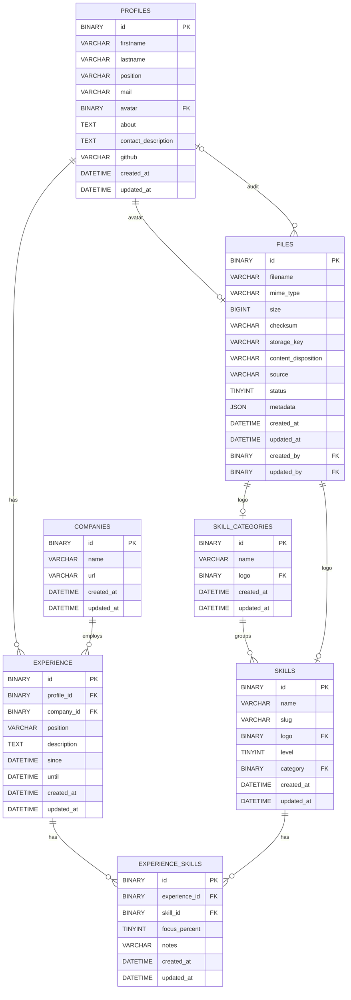

# Schemat bazy danych Portfolio

```mermaid
erDiagram

    PROFILES ||--o| FILES : avatar
    FILES }o--o| PROFILES : audit

    PROFILES ||--o{ EXPERIENCE : has
    COMPANIES ||--o{ EXPERIENCE : employs

    EXPERIENCE ||--o{ EXPERIENCE_SKILLS : has
    SKILLS ||--o{ EXPERIENCE_SKILLS : has

    SKILL_CATEGORIES ||--o{ SKILLS : groups
    FILES ||--o| SKILL_CATEGORIES : logo
    FILES ||--o| SKILLS : logo

    PROFILES {
        BINARY id PK
        VARCHAR firstname
        VARCHAR lastname
        VARCHAR position
        VARCHAR mail
        BINARY avatar FK
        TEXT about
        TEXT contact_description
        VARCHAR github
        DATETIME created_at
        DATETIME updated_at
    }

    FILES {
        BINARY id PK
        VARCHAR filename
        VARCHAR mime_type
        BIGINT size
        VARCHAR checksum
        VARCHAR storage_key
        VARCHAR content_disposition
        VARCHAR source
        TINYINT status
        JSON metadata
        DATETIME created_at
        DATETIME updated_at
        BINARY created_by FK
        BINARY updated_by FK
    }

    COMPANIES {
        BINARY id PK
        VARCHAR name
        VARCHAR url
        DATETIME created_at
        DATETIME updated_at
    }

    EXPERIENCE {
        BINARY id PK
        BINARY profile_id FK
        BINARY company_id FK
        VARCHAR position
        TEXT description
        DATETIME since
        DATETIME until
        DATETIME created_at
        DATETIME updated_at
    }

    SKILL_CATEGORIES {
        BINARY id PK
        VARCHAR name
        BINARY logo FK
        DATETIME created_at
        DATETIME updated_at
    }

    SKILLS {
        BINARY id PK
        VARCHAR name
        VARCHAR slug
        BINARY logo FK
        TINYINT level
        BINARY category FK
        DATETIME created_at
        DATETIME updated_at
    }

    EXPERIENCE_SKILLS {
        BINARY id PK
        BINARY experience_id FK
        BINARY skill_id FK
        TINYINT focus_percent
        VARCHAR notes
        DATETIME created_at
        DATETIME updated_at
    }
```